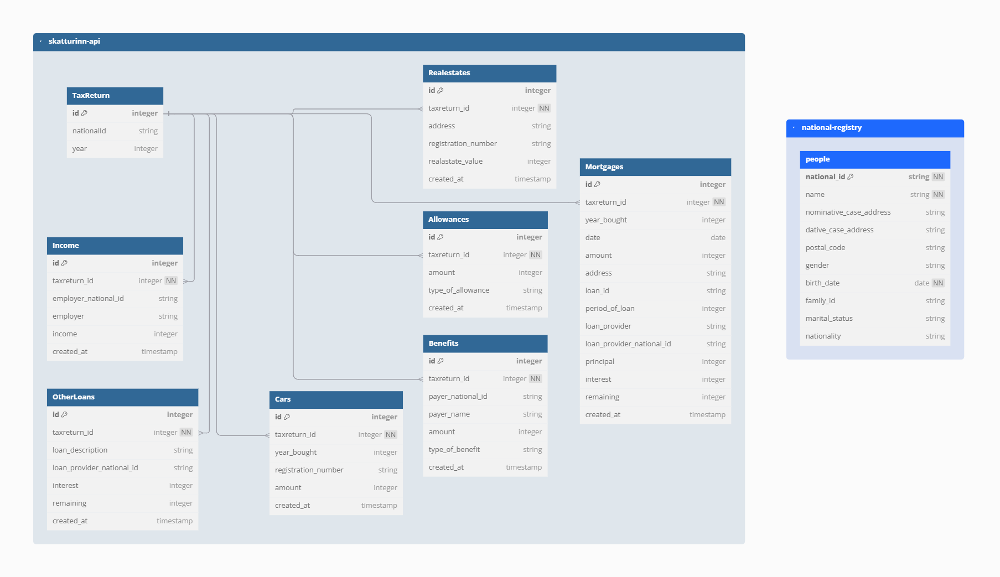

[<<< README](../README.md)

# Database Configuration

This document describes the databases used in this project.

## Overview

This project uses two databases, managed with Docker Compose:

* **National Registry Database**
A PostgreSQL database for the National Registry service. This database contains a single table designed to mock the data of a National Registry.
* **Skatturinn API Database**
A PostgreSQL database for the Skatturinn API service. It is a relational database containing eight tables.

### Database Architecture Diagram
The database schemas were designed using the web tool [dbdiagram.io](https://dbdiagram.io).

* The database **skatturinn_db-api** is an 8 table relational database
* The database **national-registry** is a 1 table database to mock connetion to the National Registry of Iceland (Þjóðskrá)




## Database Setup with Docker Compose

Both databases are defined in the Docker Compose configuration file. They are set up as services that run in Docker containers.

### Starting the Databases

* To start the National Registry Database:

  ```bash
  yarn start:national_registry_db
  ```

* To start the Skatturinn API Database:

  ```bash
  yarn start:skattur_db
  ```

* To start both databases at once:

  ```bash
  yarn all
  ```

* To stop all Docker containers:

  ```bash
  yarn docker_down
  ```

## Database Configuration Details

### PostgreSQL Configuration

* **Database Engine**: PostgreSQL
* **Ports**: Default PostgreSQL port is 5432. Ports for each database can be configured in the environment file '.env'.
* **User Credentials**: Default value is specified in the Docker Compose file, but they are set in the environment file '.env'.
* **Data Persistence**: The databases use Docker volumes to ensure data is retained even when containers are restarted.

### Database Initialization

The databases are managed using Sequelize, and they are initialized using Sequelize migrations and seeders.

* For National Registry:

  * Migrations are located at: `apps/national-registry/src/migrations`
  * Seeders are located at: `apps/national-registry/src/seeders`

* For Skatturinn API:

  * Migrations are located at: `apps/skatturinn-api/src/migrations`
  * Seeders are located at: `apps/skatturinn-api/src/seeders`

## Database Management

* To create new migrations, use:

  ```bash
  yarn create-migration:national-registry <migration-name>
  yarn create-migration:skatturinn-api <migration-name>
  ```

* To run migrations:

  ```bash
  yarn migrate:national-registry
  yarn migrate:skatturinn-api
  ```

* To run seeders:

  ```bash
  yarn seed:national-registry
  yarn seed:skatturinn-api
  ```

* To undo migrations:

  ```bash
  yarn undo:migrations:national-registry
  yarn undo:migrations:skatturinn
  ```

* To undo seeders:

  ```bash
  yarn undo:seed:national-registry
  yarn undo:seed:skatturinn
  ```
