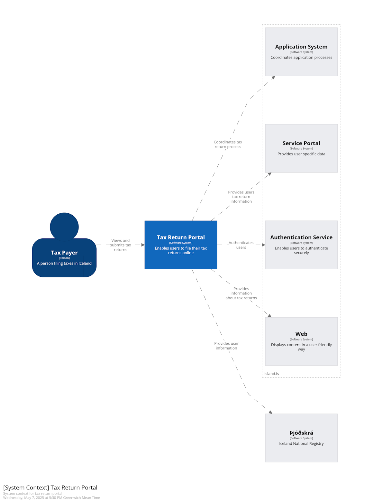
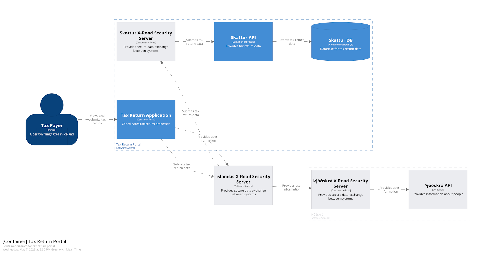
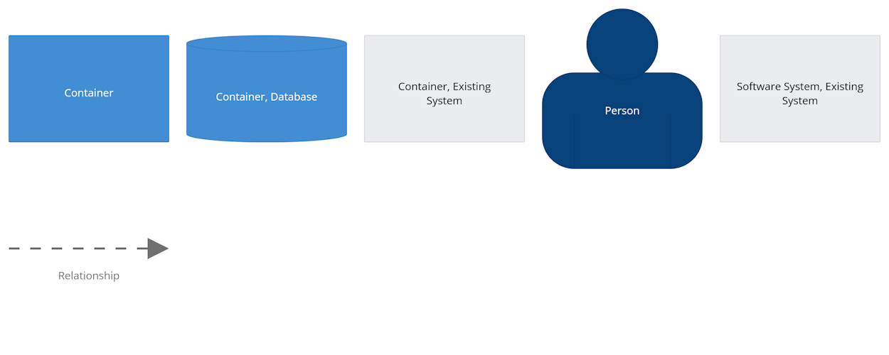

[<<< README](../README.md)

# System Diagram Creation with Structurizr

This document explains how Structurizr was used to create a system diagram for the project.

## What is Structurizr?

Structurizr is a tool for creating software architecture diagrams using the C4 model (Context, Containers, Components, and Code).

## Why Structurizr?

* Provides a clear, visual representation of our system architecture.
* Supports the C4 model, which makes it easy to understand the system at different levels of detail.
* Can be easily managed and automated using Docker.

## System Diagram

### Context



### Containers



## Setting Up Structurizr

We use Docker Compose to run Structurizr in our local environment.

### Starting Structurizr with Docker

* To start Structurizr:

  ```bash
  yarn start:structurizr
  ```
* To stop Structurizr:

  ```bash
  yarn docker_down
  ```

### Accessing Structurizr

* Once started, Structurizr can be accessed at the specified URL (typically [http://localhost](http://localhost):8080), as defined in the Docker Compose file and/or the environment file (.env).

## Creating the System Diagram

* Our system diagram follows the C4 model, providing a clear representation of the services and their interactions.

### Editing the System Diagram

* The Structurizr workspace is configured using a JSON or DSL file that defines the components, containers, and their relationships.
* To make changes to the system diagram, modify the Structurizr workspace configuration file and restart Structurizr.

## Best Practices

* Use clear, descriptive names for each component and container.
* Regularly update the system diagram to reflect any architectural changes.
* Maintain the Structurizr configuration in version control to track changes over time.

### Troubleshooting

* If the Structurizr service does not start, ensure Docker is running and that the Docker Compose configuration is correct.
* For any errors within Structurizr, check the logs in the Docker container for more details.
